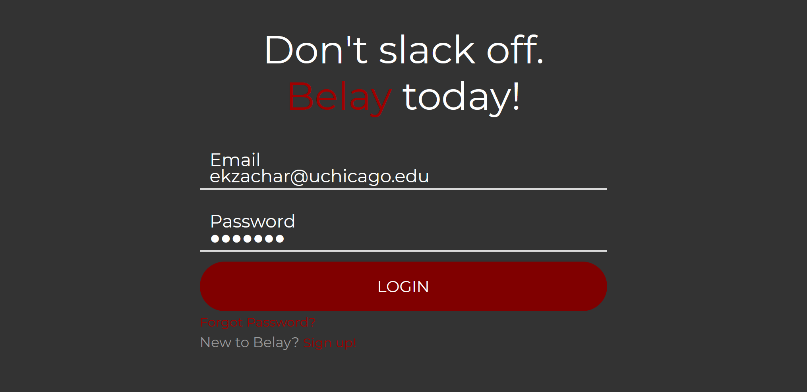
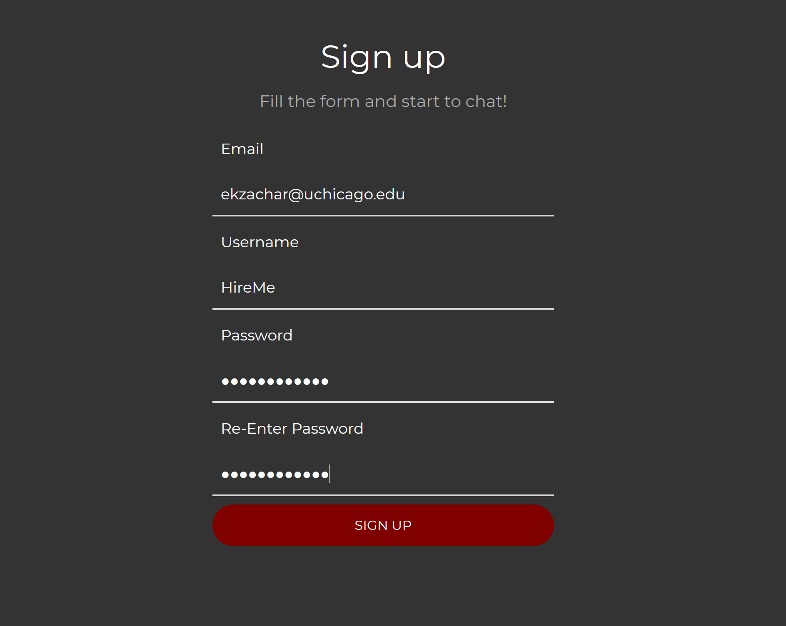
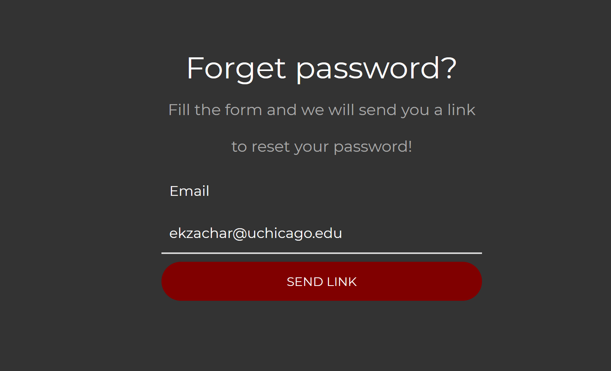
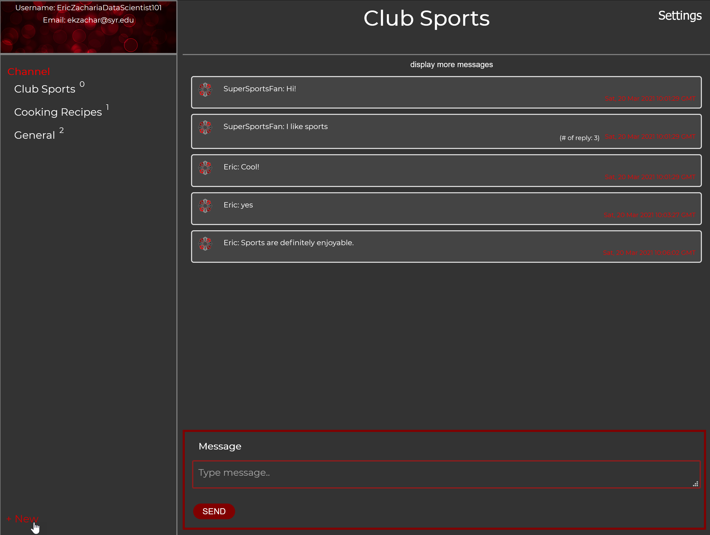

# Belay: A Slack Clone
### University of Chicago - Web Development - MPCS 52553 
### Eric Zacharia

## Preview
### Login Page

### Sign Up Page

### Forget Password Page

### Belay User Interface

## Run Instructions

1. Install all needed packages

`pip install -r requirements.txt`

2. Create the SQL database with tables locally

- open your mysql database with ` mysql -u root -p`
- paste the sql query in `create_database.sql` to create database `ekzachar`
- copy and paste the sql query in `create_tables.sql` to create tables with 
  example users, channels, and messages
- change the DB_NAME, DB_USERNAME, DB_PASSWORD to your database in `secrets.cfg`

3. Run the project using the one of the following commands 
   (Debug Mode: a. off, b: on)

a. `python -m flask run -p 5000`

b: `python app.py`